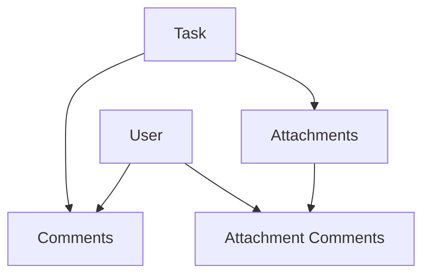

# Task Comments Implementation Documentation

## Overview
This document outlines the implementation of a commenting system for tasks and attachments in the FeaturePlus application. The system allows users to:
- Add comments to tasks
- Add comments to specific attachments within tasks
- Delete their own comments
- View comments in a threaded format

## Implementation Phases

### 1. Database Schema
**Initial Setup:**
- Created `Comment` model with relationships to:
  - Task (required)
  - Attachment (optional)
  - User (for ownership)
```go
type Comment struct {
    ID           uint
    TaskID       uint
    AttachmentID *uint     // Optional, for attachment-specific comments
    UserID       uint
    Content      string
    CreatedAt    time.Time
    UpdatedAt    time.Time
}
```

### 2. Backend Implementation

#### Repository Layer
1. Created `CommentRepository` with core operations:
   - Create comment
   - Delete comment
   - Get comments by task
   - Get comments by attachment
   - Update comment

#### Handler Layer
1. Implemented `CommentHandler` with endpoints:
   - POST `/tasks/:task_id/comments`
   - GET `/tasks/:task_id/comments`
   - GET `/attachments/:attachment_id/comments`
   - DELETE `/comments/:comment_id`
   - PUT `/comments/:comment_id`

### 3. Frontend Implementation

#### Components Structure
1. Created `TaskComments.tsx`:
   - Comment input form
   - Comments list with user info
   - Delete functionality for own comments
   - Real-time updates

2. Integrated with `TaskCard.tsx`:
   - Added comments section below attachments
   - Implemented comment-attachment relationship

### 4. Key Features Added

1. **Comment Context**
   - Comments can be on tasks or specific attachments
   - UI shows "Comment on Attachment" when attachment selected
   - Clear visual distinction between task and attachment comments

2. **User Ownership**
   - Comments show author's username
   - Delete button only visible to comment owner
   - User ID stored in localStorage for ownership checks

3. **Real-time Updates**
   - Comments appear immediately after posting
   - Optimistic updates for better UX
   - Error handling with user feedback

### 5. Challenges & Solutions

1. **Route Conflicts**
   ```
   Error: ':id' conflicts with ':task_id' in existing prefix
   ```
   - Solution: Standardized parameter names across routes
   - Fixed by consolidating task routes under single group

2. **Attachment Preview Issue**
   - Some images failed to preview after comment implementation
   - Related to route restructuring
   - Temporarily marked for future fix

3. **Comment-Attachment Relationship**
   - Initial error: Comments not linking to attachments
   - Fixed by adding proper foreign key relationships
   - Added validation in backend for attachment ownership

### 6. Testing Guide (Postman)

#### Create Comment
```http
POST /api/tasks/:task_id/comments
Body: {
    "content": "Test comment",
    "attachment_id": null  // Optional
}
Headers: 
    Authorization: Bearer <token>
Expected Response: 201 Created
```

#### Get Task Comments
```http
GET /api/tasks/:task_id/comments
Headers: 
    Authorization: Bearer <token>
Expected Response: 200 OK
```

#### Delete Comment
```http
DELETE /api/comments/:comment_id
Headers: 
    Authorization: Bearer <token>
Expected Response: 200 OK
```

### 7. Impact on Attachment Functionality

The attachment system was affected in several ways:

1. **Route Structure**
   - Original attachment routes needed restructuring
   - Changed from `/attachments` to `/tasks/:task_id/attachments`
   - Required updates in both frontend and backend

2. **UI Integration**
   - Added attachment selection feature
   - Blue highlight for selected attachment
   - Comments context switches based on selection

3. **Data Flow**
   - Attachments now carry associated comments
   - Preview functionality temporarily affected
   - File upload remained stable throughout changes

### 8. Final Architecture



### 9. Future Improvements

1. Fix image preview inconsistency
2. Add comment editing functionality
3. Implement comment notifications
4. Add rich text formatting
5. Consider real-time updates using WebSocket

This implementation provides a solid foundation for task management with threaded discussions, while maintaining flexibility for future enhancements. 